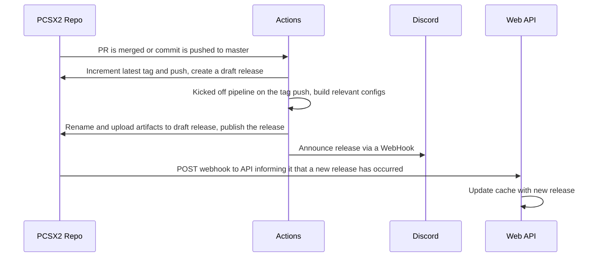

# CI Documentation

## Releases

```mermaid
sequenceDiagram
  PCSX2 Repo->>Actions: PR is merged or commit is pushed to master
  Actions->>PCSX2 Repo: Increment latest tag and push, create a draft release
  Actions->>Actions: Kicked off pipeline on the tag push, build relevant configs
  Actions->>PCSX2 Repo: Rename and upload artifacts to draft release, publish the release
  Actions->>Discord: Announce release via a WebHook
  PCSX2 Repo->>Web API: POST webhook to API informing it that a new release has occurred
  Web API->>Web API: Update cache with new release
```
