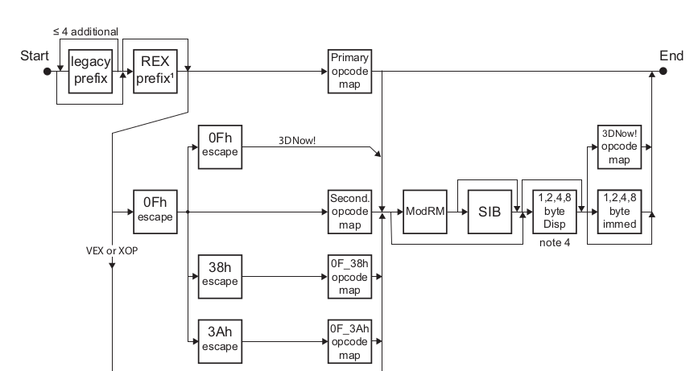
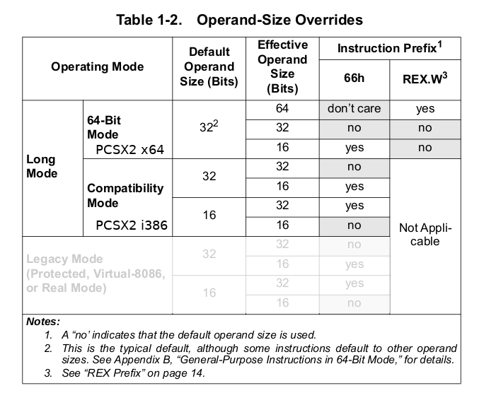

# PS2 JIT compiler port from i386/32bit to x86_64 code

PCSX2 has 6 recompilers:
* R5900-32	: EE RISC processor ("Emotion Engine")
* R3000A 	: I/O processor
* VIF0 Unpack  : Vector Unit Interface 0
* VIF1 Unpack  : Vector Unit Interface 1

Terms/abbreviations:
* GS		Graphics Synthesizer
* SIMD		Single instruction, multiple data
* ABI		Application Binary Interface (e.g. Kernel to application), either 32-bit or 64-bit
* Abbreviations used in x86 or x86_64 op codes:
  * byte        	(8 bit)		suffix b						Integer
  * word        	(2 bytes)   	suffix w						Integer
  * doubleword  	(4 bytes)   	suffix l                                                Integer
  * quadword    	(8 bytes)   	suffix q  e.g. 	movq 	copies 8 bytes			Integer
  * octword	(16 bytes)	suffix o						Integer
  * suffix z: fill leading bits with zero, e.g. copy 1 byte into 2 byte register
  * suffix s: sign extend upper portion e.g. negative byte copied to word fills with ones
  * cwtl	convert word to doublword
  * cltq 	convert doubleword to quadword
  * cqto	convert quodword to octoword
  * Floating point single 		(S)		4 bytes
  * Floating point double		(D)		8 bytes
  * Imm:		‘immediate’ value (a constant) stored in the instruction itself 
		[e.g. ADDI $1,D0]–The $ indicates the constant/immediate 
* ALU		Arithmetic and Logic Unit (performs arithmetic operations like addition and subtraction along with 
logical operations AND, OR, etc.)


Notes: 

* All processors that support the x86_64 instruction set also support the x86/i386/i686 instruction set. If a processor can run 64-bit code, it can also run 32-bit code. Each process, however, must be homogeneous, so either 32-bit or 64-bit.
* When generating code for 64-bit platforms, the order of operations may be different compared to generating 32-bit code.
* x86_64 CPUs 
  * have two modes of operation in Long Mode, a 64-bit mode and compatibility mode. In compatibility mode, the default address size is 32 bits.
  * still make available x87/MMX registers in 64-bit mode 
  * provide full x86 16-bit and 32-bit instruction sets without intervening emulation

Central files:
* pcsx2/pcsx2/R5900.cpp: EE emulation
* /pcsx2/x86/iCore.cpp
* pcsx2/x86/ix86-32/iR5900-32.cpp: initialization of recLUT and recLutReserve_RAM, recompilation code
* common/src/x86emitter/x86emitter.cpp

Questions to resolve:
* Which instructions have to be ported? --> SIB 32bit does not have a corresponding 64-bit equivalent
* Which modules are affected?

Existing instruction sets on i386:

* MMX: a single instruction, multiple data (SIMD) instruction set 
  * 57 instructions
  * 64-bit wide register file (MM0-MM7)
  * only integer operations
  * not able to mix integer-SIMD ops with any floating-point ops
* SSE1: Streaming SIMD Extension 1
  * 128-bit wide register file (XMM0–XMM7) 
* SSE2: Streaming SIMD Extensions 2
* SSSE3: Supplemental Streaming SIMD Extensions 3
* SSE4: Streaming SIMD Extensions 2
* AVX: 											Floating Point
  * Advanced Vector Extensions (since 2011). AVX provides new features, new instructions and a new coding scheme.
  * AVX uses sixteen YMM registers to perform a Single Instruction on Multiple pieces of Data (see SIMD). 
  * The AVX instructions support both 128-bit and 256-bit SIMD
  * Each YMM register can hold and do simultaneous operations (math) on: 
   * eight 32-bit single-precision floating point numbers or 
   * four 64-bit double-precision floating point numbers.
* AVX2 expands most integer commands to 256 bits and introduces fused multiply-accumulate (FMA) operations


Primary opcode maps:			(Escape sequences allow for different maps)
http://sparksandflames.com/files/x86InstructionChart.html


Registers on x86_64:

| 8-byte register | Byte 3-0 | Byte 1-0 | Byte 0 |
| --------------- | -------- | -------- | ------ |
| rax | Eax | ax | al |
| rcx | ecx | cx | cl |
| rdx | edx | dx | dl |
| rbx | ebx | bx | bl |
| rsi | esi | si | sil |
| rdi | edi | di | dil |
| rsp | esp | sp | spl |
| rbp | ebp | bp | bpl |
| r8 | r8d | r8w | r8b |
| r9 | r9d | r9w | r9b |
| r10 | r10d | r10w | r10b |
| r11 | r11d | r11w | r11b |
| r12 | r12d | r12w | r12b |
| r13 | r13d | r13w | r13b |
| r14 | r14d | r14w | r14b |
| r15 | r15d | r15w | r15b |

Instruction encoding on AMD64:




Understanding the tables recLUT and recLutReserve_RAM, the macro PC_GETBLOCK, and the pseudo assembler code in _DynGen_DispatcherReg and _DynGen_JITCompile:

 * Ram is mirrored.
 * 0x8000_0000 area is physical and cached. Kernel
 * 0 is virtual memory which is often mapped 1:1 to the physical mem
 * 0xa000_0000 iirc is for supervisor mode (middle between kernel and user)
 * 0xb000_0000 is uncached (rom)
 
 * Ps2MemSize::MainRam / 4 = 0x00800000; MainRam = 32MB (i386) / 64MB (x64)
 * Ps2MemSize::Rom / 4  = 0x00100000;     Rom    = 4MB (i386) / 8MB (x64)
 * Ps2MemSize::Rom1 / 4 = 0x00010000      Rom1	 = 256kB (i386) / 512MB (x64)

Each entry in recLUT is used to jump into 64k elements (one page) of recLutReserve_RAM according to the program counter of the PS2 cpu.
```
uptr* fp = reclut[ pc >> 16] + pc*sizeof(uptr)/4;
jump fp[0];
```
This is how a recLUT entry is generated:
```C++

recLUT_SetPage(recLUT, hwLUT, recROM, 0xa000, i, i - 0x1fc0); // i=0x1fc0
// --> pagebase+pageidx=0xbfc00000= start value of pc


// 32-bits
d                       = -bfc0 = 0xFFFF4040;
e                       = trunc32(0xFFFF4040 << 14) = trunc32(0x3FFFD0100000) = 0xD0100000;
u                       = recLutReserve_RAM+ 32Mb + 4*0xD0100000;
                        = 0xb35bc000 + 0x2000000 + 4*0xD0100000;
0xb35bc000 + 0x2000000 + 4*0xD0100000 + 0xbfc00000
0xb35bc000 + 0x2000000 + trunc32(340400000) + 0xbfc00000
0xb35bc000 + 0x2000000 + 0x40400000 + 0xbfc00000
trunc32(u + 0xbfc00000) = recLutReserve_RAM+ 32MB;
                        = 0xb35bc000 + 0x2000000;
                        = 0xB55BC000;
// 64-bits
d                       = 0x0 -(bfc0 * sizeof(uptr)/4) = -(bfc0 << 1) = 0xFFFFFFFFFFFE8080;
e                       = trunc64(0xFFFFFFFFFFFE8080 << 13) = 0xffffFFFFD0100000;
u                       = recLutReserve_RAM + 64MB + 8*0xffffFFFFD0100000;
                        = 0x7fff6777f000 + 0x4000000 + 8*0x0xffffFFFFD0100000;
0x7fff6777f000 + 0x4000000 + 8*0xffffFFFFD0100000 + (0xbfc00000 << 1)           = 0x7fff6777f000 + 0x4000000
0x7fff6777f000 + 0x4000000 + trunc64(7FFFFFFFE80800000) + 0x17F800000           = 0x7fff6777f000 + 0x4000000
 
0x7fff6777f000 + 0x4000000 + 0xFFFFFFFE80800000 +         0x17F800000           = 0x7fff6777f000 + 0x4000000
<--------------  recLUT[0xbfc0] -------------->   <-0xbfc00000*sizeof(uptr)/4->  <-recLutReserve_RAM + 64MB->

--> recLUT[0xbfc0] = 0x7fff6777f000 + 0x4000000 + 0xFFFFFFFE80800000 
                   = 0x7FFDEBF7F000
--> recLUT[0xbfc0] + (0xbfc00000 << 1) = recLutReserve_RAM+ 64MB

```


|// i386 address | i386 jitted assembler | x64 address | x64 jitted assembler |
| ------------------------- | ------------------------- | ------------------------- | ------------------------- |
0x30000000|  nop|0x210000000|  nop
   0x30000001|  mov    0x58b7e82c,%eax|   0x210000001|  movabs 0x555557e05b0c,%eax
   0x30000006|  cltd   |   0x21000000a|  cltd   
   0x30000007|  mov    %eax,0x58b7e770|   0x21000000b|  movabs %eax,0x555557e05a54
   0x3000000c|  mov    %edx,0x58b7e774|   0x210000014|  mov    %edx,%eax
-|-|   0x210000016|  movabs %eax,0x555557e05a50
   0x30000012|  nop|   0x21000001f|  nop
   0x30000013|  nop|   0x210000020|  nop
-|-|   0x210000021|  movabs 0x555557e05a54,%eax
   0x30000014|  cmpl   $0x0,0x58b7e774|   0x21000002a|  cmp    $0x0,%eax
   0x3000001b|  mov    $0x1,%eax|   0x21000002d|  mov    $0x1,%eax
   0x30000020|  jl     0x3000002f|   0x210000032|  jl     0x21000004b
   0x30000022|  jg     0x3000002d|   0x210000034|  jg     0x210000049
-|-|   0x210000036|  movabs 0x555557e05a50,%eax
   0x30000024|  cmpl   $0x59,0x58b7e770|   0x21000003f|  cmp    $0x59,%eax
-|-|   0x210000042|  mov    $0x1,%eax
   0x3000002b|  jb     0x3000002f|   0x210000047|  jb     0x21000004b
   0x3000002d|  xor    %eax,%eax|   0x210000049|  xor    %eax,%eax
   0x3000002f|  mov    %eax,0x58b7e5e0|   0x21000004b|  movabs %eax,0x555557e058c0
-|-|   0x210000054|  xor    %eax,%eax
   0x30000034|  movl   $0x0,0x58b7e5e4|   0x210000056|  movabs %eax,0x555557e058c4
   0x3000003e|  nop|   0x21000005f|  nop
-|-|   0x210000060|  movabs 0x555557e058c0,%eax
-|-|   0x210000069|  mov    %eax,%ebx
-|-|   0x21000006b|  movabs 0x5555580fc120,%eax
   0x3000003f|  cmpl   $0x0,0x58b7e5e0|   0x210000074|  cmp    %ebx,%eax
   0x30000046|  jne    0x30000055|   0x210000076|  jne    0x210000094
-|-|   0x210000078|  movabs 0x555557e058c4,%eax
-|-|   0x210000081|  mov    %eax,%ebx
-|-|   0x210000083|  movabs 0x5555580fc124,%eax
   0x30000048|  cmpl   $0x0,0x58b7e5e4|   0x21000008c|  cmp    %ebx,%eax
   0x3000004f|  je     0x3000007e|   0x21000008e|  je     0x2100000e3
   0x30000055|  nop|   0x210000094|  nop
   0x30000056|  movl   $0xbfc00024,0x58b7e878|   0x210000095|  mov    $0xbfc00024,%eax
   0x30000060|  mov    0x58b7e990,%eax|   0x21000009a|  movabs %eax,0x555557e05b58
-|-|   0x2100000a3|  movabs 0x555557e05c70,%eax
   0x30000065|  add    $0xb,%eax|   0x2100000ac|  add    $0xb,%eax
   0x30000068|  mov    %eax,0x58b7e990|   0x2100000af|  movabs %eax,0x555557e05c70
-|-|   0x2100000b8|  mov    %eax,%ebx
-|-|   0x2100000ba|  movabs 0x555557e04de0,%eax
   0x3000006d|  sub    0x58b7db40,%eax|   0x2100000c3|  sub    %eax,%ebx
-|-|   0x2100000c5|  mov    %ebx,%eax
-|-|   0x2100000c7|  jns    0x2100000d6 //skip next two if not signed
-|-|   0x2100000c9|  movabs $0x55555810303b,%rax
   0x30000073|  js     0x58d79019 <_ZL16eeRecDispatchers+25>|   0x2100000d3|  rex.W jmpq *%rax
-|-|   0x2100000d6|  movabs $0x555558103000,%rax
   0x30000079|  jmp    0x58d79000 <_ZL16eeRecDispatchers>|   0x2100000e0|  rex.W jmpq *%rax
   0x3000007e|  nop|   0x2100000e3|  nop
   0x3000007f|  movl   $0xbfc00014,0x58b7e878|   0x2100000e4|  mov    $0xbfc00014,%eax
   0x30000089|  mov    0x58b7e990,%eax|   0x2100000e9|  movabs %eax,0x555557e05b58
-|-|   0x2100000f2|  movabs 0x555557e05c70,%eax
   0x3000008e|  add    $0xb,%eax|   0x2100000fb|  add    $0xb,%eax
   0x30000091|  mov    %eax,0x58b7e990|   0x2100000fe|  movabs %eax,0x555557e05c70
-|-|   0x210000107|  mov    %eax,%ebx
-|-|   0x210000109|  movabs 0x555557e04de0,%eax
   0x30000096|  sub    0x58b7db40,%eax|   0x210000112|  sub    %eax,%ebx
-|-|   0x210000114|  mov    %ebx,%eax
-|-|   0x210000116|  jns    0x210000125 //skip next two if not signed
-|-|   0x210000118|  movabs $0x55555810303b,%rax
   0x3000009c|  js     0x58d79019 <_ZL16eeRecDispatchers+25>|   0x210000122|  rex.W jmpq *%rax
-|-|   0x210000125|  movabs $0x555558103000,%rax
   0x300000a2|  jmp    0x58d79000 <_ZL16eeRecDispatchers>|   0x21000012f|  rex.W jmpq *%rax

