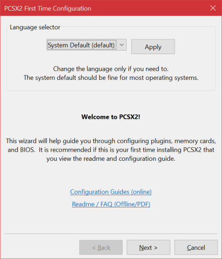
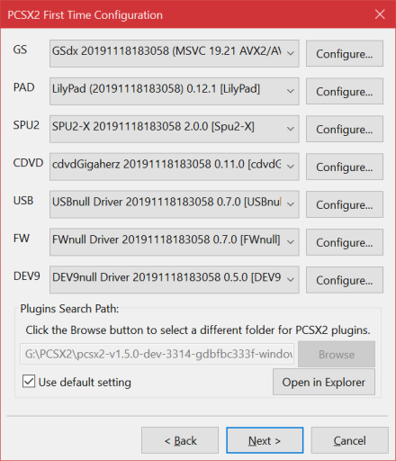
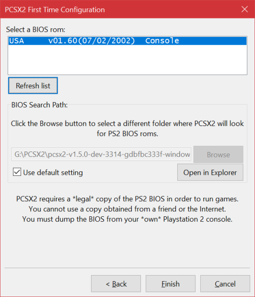

<!-- PDF METADATA STARTS ---
title: "PCSX2 - Configuration Guide"
date: "2020"
footer-left: "[Document Source](https://github.com/PCSX2/pcsx2/blob/{LATEST-GIT-TAG}/pcsx2/Docs/Configuration_Guide/Configuration_Guide.md)"
urlcolor: "cyan"
... PDF METADATA ENDS -->

# PCSX2 First Time Setup and Configuration
This guide will walk through the initial setup process of PCSX2 and the basics of configuration.

*Note: While this document is using Windows screenshots, you can still follow this guide for Linux.*

\pagebreak

## First Time Setup
The first time you launch PCSX2, you will be prompted with a First Time Configuration wizard.

### Language Selection
You may choose to change the UI language of PCSX2 here.

*Note: Translations may not be accurate or actively maintained by translators. If you find translation issues and want to fix them yourself, please get into contact with the PCSX2 team by opening a [thread on the PCSX2 forums](https://forums.pcsx2.net/) or an [issue on GitHub](https://github.com/PCSX2/pcsx2/issues).*

### Plugin Selection
Most users running on a modern PC will be able to continue normally here without changing any settings.

If you try to continue with setup and you get a warning that the GS plugin failed to load or was incompatible, change the GS plugin from the default AVX2 option to the SSE4.1 option. If the same issue occurs, change the GS plugin from SSE4.1 to SSE2. If the issue persists, your PC may be severely outdated and we recommend asking for help on the [PCSX2 Forums](https://forum.pcsx2.net).

If you have a custom plugin, you may wish to add it to the default plugin folder. Hit the "Open in Explorer" button to jump straight to the plugin folder.

If you are an advanced user or developer, you may wish to change the plugin directory. Uncheck the "Use default setting" box to do so.

### BIOS Selection
PCSX2 will now ask you to provide your PS2's BIOS dump. Use the "Open in Explorer" button to open the BIOS folder, and drop your BIOS files inside. Then use the "Refresh List" button to show your BIOS in the list. Click it, then hit Finish.

Advanced users may wish to use a different folder for their BIOS, you can do so by unchecking the "Use default setting" box and then hitting Browse to select a new folder.

## Post-Setup Configuration
A large number of games work out-of-the-box on default PCSX2 settings. However, a subset of games require special settings to run, and some games require special settings to be upscaled. This guide will briefly cover some frequent problems and configuration settings to address them. 

### Multi-Threaded VU1 (MTVU)
The MTVU option is a unique case of a recommended setting that is **not** enabled by default. MTVU boosts performance for PCs with at least 3 cores with almost no consequences for the overwhelming majority of games. However, a small number of high profile games are incompabible with MTVU and will break if it is enabled. For these reasons, we do not enable it by default, **but strongly recommend you do so yourself**. If your game fails to boot, crashes, stalls, or has other problems with it enabled, disable it and try again.

### Specific game solutions
Looking for information specific to a single game? Head to the [PCSX2 Wiki](https://wiki.pcsx2.net/Main_Page) and search for your game using the search bar in the top right. Known issues and solutions should be towards the bottom of a game's wiki page.

### General solutions
Want some general ideas to try that are not specific to a game? Here are some more commonly known issues and solutions to try. 
*Note: For some of these issues, multiple solutions are given one after the other. Before moving from one solution to the next, **undo the previous solution**. Stacking multiple fixes on top of each other is usually unnecessary and likely to introduce new issues.*

#### Grid-like pattern on screen
Usually this is due to upscaling, which can cause sprites and 2D textures to misalign. Any fixes will be found in the GSdx Advanced Settings and Hacks:
`Config > Video (GS) > Plugin Settings > Advanced Settings and Hacks`
First try the two Round Sprite modes, Half and Full. Then try Align Sprite or Merge Sprite. Then try the Half Pixel Offset modes. If all else fails, consider using the Texture Offsets.

#### Outlines on shapes or models are improperly sized/aligned
Usually this is because of an upscaling hack known formerly as Unscale Point and Line. This is now enabled by default because the overwhelming majority of games work nicely with it or need it. Navigate to the GSdx Advanced Settings and Hacks:
`Config > Video (GS) > Plugin Settings > Advanced Settings and Hacks`
Check the Disable Safe Features box.

#### Ghosting and bloom misalignment
Upscaling can cause some screen elements, usually but not always bloom effects, to misalign. Navigate to the GSdx Advanced Settings and Hacks:
`Config > Video (GS) > Plugin Settings > Advanced Settings and Hacks`
Try the various Half Pixel Offset modes. The further down the list you go, the more aggressive the hack gets. Once you find a mode that properly fixes the ghosting/misalignment, do not push it further. Also note in some games, the further you upscale, the worse the ghosting/misalignment gets. In some of these games, Half Pixel Offset may mitigate the issue, but not be able to fully resolve it.

#### Flickering or improper lightning
Sometimes a game uses blending for lighting effects and needs more accuracy for blending to work correctly. Navigate to the GSdx Plugin Settings:
`Config > Video (GS) > Plugin Settings`
Increment Blending Accuracy until the problem goes away. Note, higher Blending Accuracy substantially increases performance requirements.

#### Flickering or improperly shaped shadows
This can either be a GS or VU problem so solutions will vary wildly by game. 

##### GS
Navigate to the GSdx Advanced Settings and Hacks:
`Config > Video (GS) > Plugin Settings > Advanced Settings and Hacks`
Try checking Disable Safe Features.

##### VU
Navigate to the VU settings:
`Config > Emulation Settings > VUs`
Try different combinations of VU0/VU1 Advanced Recompiler Options. Only change one of them at a time, and keep trying all possible combinations. If none of these work, Restore Defaults and then try changing the Recompiler/Interpreter modes. Only try Interpreter as a last ditch effort.

#### Spikey Polygon Syndrome (SPS)
SPS is the tendency of world geometry or character models to deform into wildly incorrect shapes, usually resulting in the generation of spikes. This is almost always a VU problem. Navigate to the VU settings:
`Config > Emulation Settings > VUs`
Try different combinations of VU0/VU1 Advanced Recompiler Options. Only change one of them at a time, and keep trying all possible combinations. If none of these work, Restore Defaults and then try changing the Recompiler/Interpreter modes. Only try Interpreter as a last ditch effort.

#### Menu items or text overlays missing
This is usually a VU issue, but can sometimes be an EE issue. Navigate to the VU settings:
`Config > Emulation Settings > VUs`
Try different combinations of VU0/VU1 Advanced Recompiler Options. Only change one of them at a time, and keep trying all possible combinations. If none of these work, Restore Defaults and then try changing the Recompiler/Interpreter modes. Only try Interpreter as a last ditch effort. If the issue persists, navigate to the EE settings:
`Config > Emulation Settings > EE/IOP`
Try different combinations of EE/FPU Advanced Recompiler Options. Only change one of them at a time, and keep trying all possible combinations. If none of these work, Restore Defaults and then try changing the Recompiler/Interpreter modes. Only try Interpreter or Enable EE Cache as a last ditch effort.

#### AI pathfinding/vision and other behaviors, progress flags not triggering, or world objects missing
This is usually an EE issue, but can sometimes be a VU issue. Navigate to the EE settings:
`Config > Emulation Settings > EE/IOP`
Try different combinations of EE/FPU Advanced Recompiler Options. Only change one of them at a time, and keep trying all possible combinations. If none of these work, Restore Defaults and then try changing the Recompiler/Interpreter modes. Only try Interpreter or Enable EE Cache as a last ditch effort. If the issue persists, navigate to the VU settings:
`Config > Emulation Settings > VUs`
Try different combinations of VU0/VU1 Advanced Recompiler Options. Only change one of them at a time, and keep trying all possible combinations. If none of these work, Restore Defaults and then try changing the Recompiler/Interpreter modes. Only try Interpreter as a last ditch effort.

There are some known issues with specific games that are programming level issues rather than configuration level; please check the [PCSX2 Wiki](https://wiki.pcsx2.net/Main_Page) if these solutions do not help.

#### Colored vertical bands appear on screen
This is an old issue that is believed to be resolved, but there may still be a game or two that this has not been reported on yet. Unfortunately, this is a programming problem and not a configuration problem. If you encounter this, please submit a [bug report on the forums](https://forums.pcsx2.net/Forum-Bug-reporting) or an [issue on GitHub](https://github.com/PCSX2/pcsx2/issues). To remove the color banding, switch GSdx to a Software Renderer using the F9 key or by going in to your GSdx Plugin Settings:
`Config > Video (GS) > Plugin Settings > Renderer`
