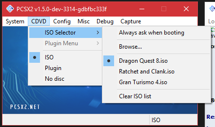
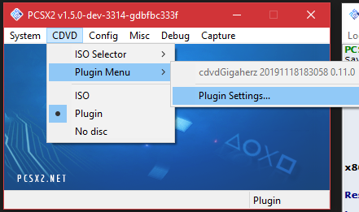
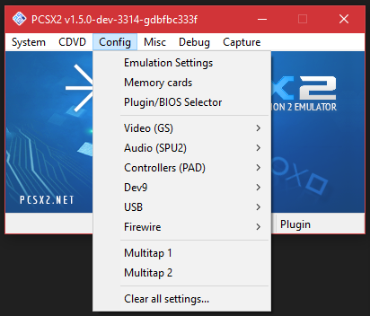

# Configuration Settings Details
This guide is a bullet list of all configuration settings in PCSX2. This is not a walkthrough or FAQ style guide, but a reference manual listing all options and giving some descriptions for how they work.

### The System menu
This menu controls core PCSX2 functions such as starting, pausing and stopping emulation, save states, widescreen patches and cheats. 

* Boot ISO (full) - Boot the PS2 BIOS, which will then boot your PS2 game. This is usually the safer boot mode, as it will correctly pass language and time information from the PS2 BIOS to the game, but will take a few seconds longer to go through the PS2 splash screens.
* Boot ISO (fast) - Directly execute your PS2 game's main executable. This is usually faster, but it will not get any language or time information from your PS2 BIOS, so your game may end up booting in to the wrong language if it has multi-language support, or using an incorrect date and time if the game relies on the PS2's system clock.
* Run ELF... - Directly execute a PS2 ELF file. If you have a standalone ELF file for the PS2, this is how you can execute it. This is NOT for use with officially released PS2 games.
* Pause/Resume - While emulation is running, this will pause the emulator or resume it. This is not the same as pausing in-game; this is interrupting the PCSX2 program's emulation and then resuming it.

*About Save States: Save states are dumps of PS2 memory that can be injected back into the emulator. This means you can capture the "state" of the emulator (saving), and then return back to that exact "state" at any time (loading). Because cheats and widescreen patches are also injected into PS2 memory, this means that the state of a cheat or widescreen patch is also preserved inside a save state.*

* Load state - Load a save state. This will immediately pause emulation, inject the save state's memory into the emulated PS2's memory, and then resume. 
* Save state - Save a save state. This will immediately pause emulation, dump the emulated PS2's memory into a save state file, and then resume.
* Backup before save - Enabling this will make PCSX2 backup your previous save state, if you are saving to a slot that is already used. Your old save state will be given a .backup extension, and the new save state will be written normally.
* Automatic Gamefixes - When enabled, PCSX2 will use its game database to automatically apply any needed gamefixes to a game. The console title bar will display how many, if any, are activated. 
* Enable Cheats - When enabled, cheats will be read from the configured cheats folder. Cheats are only applied when a game is booted; enabling this while a game is running will have no effect. 
* Enable Widescreen Patches - When enabled, widescreen patches will be read from the widescreen patch archive (cheats_ws.zip) and cheats_ws folder. Widescreen patches are only applied when a game is booted; enabling this while a game is running will have no effect.
* Enable Recording Tools - Enable a new set of TAS/Recording tools. For advanced users who want to do Tool Assisted Speedruns.
* Shutdown - Stops emulation, equivalent to holding the power button down on the PS2.
* Exit - Closes PCSX2. If emulation is running, it will be stopped.

### The CDVD menu
This menu controls ISO/CD/DVD loading for PCSX2.

| ISO Mode: | CDVD Mode: |
| --- | --- |
|  |  |

* ISO Selector: Allows you to pick an ISO to boot.
    * Always ask when booting: Ignore the ISO list and its selection, instead always open a file browser to pick an ISO when booting.
    * Browse...: Open a file browser to pick and add an ISO to the list.
    * *Various game titles*: Example games added to demonstrate the list. The game with the highlighted dot next to it is the game that will be booted.
    * Clear ISO list: Completely empties the ISO list.
* Plugin Menu: Allows you to access the CDVD plugin settings
    * Plugin Settings...: Access the CDVD plugin settings
* ISO: Enables ISO Selector and will make PCSX2 use the selected ISO when booting.
* Plugin: Enables Plugin Menu and will make PCSX2 use a physical disc drive and PS2 disc when booting.
* No disc: Emulate an empty disc drive. The boot options will be replaced with Boot BIOS, which will boot your PS2 BIOS.

### The Config menu
This menu controls the core and plugin configurations for PCSX2.

* Emulation Settings: Opens a menu for core emulator settings. Contains options for PS2 CPU modes, window options and speedhacks.
    * EE/IOP: Settings for the emulated PS2 EE and IOP CPUs. Intended only for fixing broken games, these will not speed up games.
        * EmotionEngine: The EE, the main CPU of the PS2. Controls the method of processing EE code.
            * Interpreter: "Quite possibly the slowest thing in the universe", only exists for diagnostic purposes. Both speed and accuracy will be severely reduced.
            * Recompiler: Recommended mode, performs just-in-time (JIT) recompilation of PS2 EE MIPS to PC x86 code.
            * Enable EE Cache (Slower): For Interpreter only. Emulates the EE cache, slowing down emulation even more. For diagnostics only. 
        * IOP: The Input Output Processor, the main CPU of the PS1 used to control input and output devices on the PS2. Controls the method of processing IOP code.
            * Interpreter: Slower, exists for diagnostic reasons. Speed will be reduced, but can still be used on a reasonably strong CPU. May help on rare occasions with sound and memory card problems.
            * Recompiler: Recommended mode, performs just-in-time (JIT) recompilation of MIPS to PC x86 code.
* Memory cards: Opens a menu for memory card management. Allows creating, moving and deleting memory cards, as well as a few settings.
* Plugin/BIOS Selector: Opens the plugin/BIOS configuration screen from the initial setup wizard. Allows you to change plugins or BIOS, as well as folder paths for things like save states and screenshots.
* Video (GS): Provides access to core settings for the GS, as well as plugin settings for the GS plugin.
    * Core GS Settings: 
