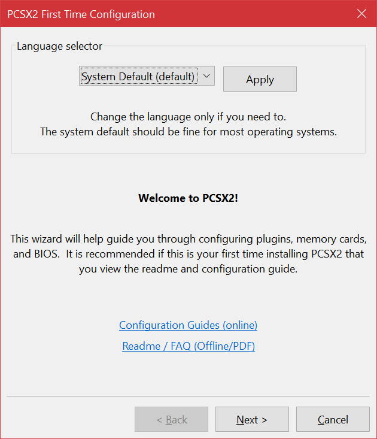
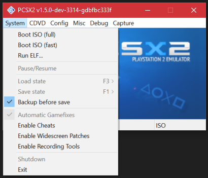

# PCSX2 Configuration: Windows
This guide will walk through the initial setup process of PCSX2 and the basics of configuration.

## First Time Setup
The first time you launch PCSX2, you will be prompted with a First Time Configuration wizard.

### Language Selection
You may choose to change the UI language of PCSX2 here.

### Plugin Selection
Most users running on a modern PC will be able to continue normally here without changing any settings.

If you try to continue with setup and you get a warning that the GS plugin failed to load or was incompatible, change the GS plugin from the default AVX2 option to the SSE4.1 option. If the same issue occurs, change the GS plugin from SSE4.1 to SSE2. If the issue persists, your PC may be severely outdated and we recommend asking for help on the [PCSX2 Forums](https://forum.pcsx2.net).

If you have a custom plugin, you may wish to add it to the default plugin folder. Hit the "Open in Explorer" button to jump straight to the plugin folder.

If you are an advanced user or developer, you may wish to change the plugin directory. Uncheck the "Use default setting" box to do so.

### BIOS Selection
PCSX2 will now ask you to provide your PS2's BIOS dump. Use the "Open in Explorer" button to open the BIOS folder, and drop your BIOS files inside. Then use the "Refresh List" button to show your BIOS in the list. Click it, then hit Finish.

Advanced users may wish to use a different folder for their BIOS, you can do so by unchecking the "Use default setting" box and then hitting Browse to select a new folder.

## Post-Setup Configuration
PCSX2 has a lot of configuration options relating to the various parts of the PS2 console.

### The System menu
This menu controls core PCSX2 functions such as starting, pausing and stopping emulation, save states, widescreen patches and cheats. 

* Boot ISO (full) - Boot the PS2 BIOS, which will then boot your PS2 game. This is usually the safer boot mode, as it will correctly pass language and time information from the PS2 BIOS to the game, but will take a few seconds longer to go through the PS2 splash screens.
* Boot ISO (fast) - Directly execute your PS2 game's main executable. This is usually faster, but it will not get any language or time information from your PS2 BIOS, so your game may end up booting in to the wrong language if it has multi-language support, or using an incorrect date and time if the game relies on the PS2's system clock.
* Run ELF... - Directly execute a PS2 ELF file. If you have a standalone ELF file for the PS2, this is how you can execute it. This is NOT for use with officially released PS2 games.
* Pause/Resume - While emulation is running, this will pause the emulator or resume it. This is not the same as pausing in-game; this is interrupting the PCSX2 program's emulation and then resuming it.

*About Save States: Save states are dumps of PS2 memory that can be injected back into the emulator. This means you can capture the "state" of the emulator (saving), and then return back to that exact "state" at any time (loading). Because cheats and widescreen patches are also injected into PS2 memory, this means that the state of a cheat or widescreen patch is also preserved inside a save state.*

* Load state - Load a save state. This will immediately pause emulation, inject the save state's memory into the emulated PS2's memory, and then resume. 
* Save state - Save a save state. This will immediately pause emulation, dump the emulated PS2's memory into a save state file, and then resume.
* Backup before save - Enabling this will make PCSX2 backup your previous save state, if you are saving to a slot that is already used. Your old save state will be given a .backup extension, and the new save state will be written normally.
* Automatic Gamefixes - When enabled, PCSX2 will use its game database to automatically apply any needed gamefixes to a game. The console title bar will display how many, if any, are activated. 
* Enable Cheats - When enabled, cheats will be read from the configured cheats folder. Cheats are only applied when a game is booted; enabling this while a game is running will have no effect. 
* Enable Widescreen Patches - When enabled, widescreen patches will be read from the widescreen patch archive (cheats_ws.zip) and cheats_ws folder. Widescreen patches are only applied when a game is booted; enabling this while a game is running will have no effect.
* Enable Recording Tools - Enable a new set of TAS/Recording tools. For advanced users who want to do Tool Assisted Speedruns.
* Shutdown - Stops emulation, equivalent to holding the power button down on the PS2.
* Exit - Closes PCSX2. If emulation is running, it will be stopped.

